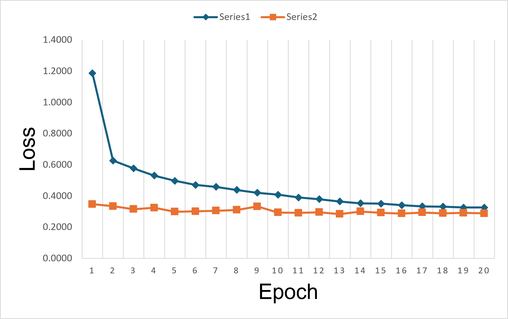
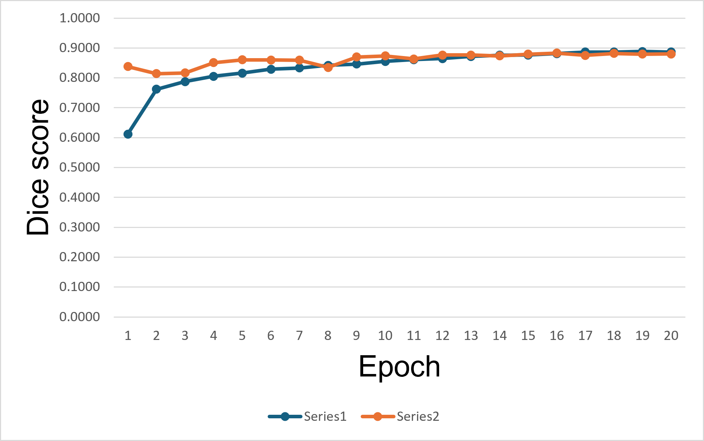

# UW-Madison GI Tract Image Segmentation

## Project Overview

This project builds a deep learning pipeline for multi-class medical image segmentation on the **UW-Madison GI Tract Image Segmentation** dataset. The goal is to segment three gastrointestinal organs from abdominal MRI slices:

- `large_bowel`
- `small_bowel`
- `stomach`

The final model predicts pixel-level probability maps for each organ, converts them into binary masks using class-specific thresholds, and encodes the masks into run-length encoding (RLE) format for Kaggle submission.

The project follows a complete segmentation workflow, including data parsing, RLE mask decoding, 2.5D input construction, model training, validation, threshold tuning, and final submission generation.

---

## Final Submission Result

The final submitted version achieved the following Kaggle scores:

| Metric | Score |
|---|---:|
| Public Score | 0.80577 |
| Private Score | 0.77297 |

The final inference thresholds were selected separately for each organ:

```python
thresholds = {
    "large_bowel": 0.39,
    "small_bowel": 0.59,
    "stomach": 0.33,
}
```

---

## Dataset and Task

Each training image is a grayscale MRI slice from a patient case and scan day. The label file provides one row per image and organ class, where the segmentation mask is stored as an RLE string.

The original annotation table is converted from long format to wide format so that each image has one row containing the three organ masks:

```text
id | large_bowel | small_bowel | stomach
```

Empty masks are treated as background-only samples. This is important because many slices do not contain any visible target organ.

---

## Data Preprocessing

### 1. Metadata Extraction

Image metadata is extracted from the file path and image filename. This includes:

- case ID
- day ID
- slice number
- image height and width
- pixel spacing information
- full image path

This metadata is used to match images with their labels and to construct neighboring-slice inputs.

### 2. Correct RLE Decoding

The segmentation masks are decoded using **C-order** array layout. This is an important implementation detail because using the wrong RLE order causes the decoded masks to be spatially misaligned with the MRI image.

The corrected workflow uses C-order decoding for all ground-truth masks and final RLE handling.

### 3. 2.5D Input Construction

Instead of using only the current slice, the model uses a 2.5D input representation. For each center slice `n`, the input contains:

```text
[n - 2, n, n + 2]
```

These three grayscale slices are stacked as a 3-channel image. This allows the model to use limited through-plane anatomical context while still using a standard 2D segmentation network.

If a neighboring slice does not exist, the nearest available slice is used as a fallback.

### 4. Image Normalization

Each MRI slice is normalized independently using percentile clipping:

1. Compute the 1st and 99th intensity percentiles.
2. Clip intensities to this percentile range.
3. Scale the clipped image to the `[0, 1]` range.

This reduces the effect of extreme intensity values while preserving useful anatomical contrast.

### 5. Train/Validation Split

The dataset is split using `GroupKFold` with case ID as the grouping variable. This prevents images from the same patient case from appearing in both training and validation sets.

The current experiment trains and validates on:

```text
Number of folds: 5
Training fold: all folds except fold 0
Validation fold: fold 0
```

---

## Model Architecture

The model is a U-Net segmentation network with an EfficientNet-B0 encoder.

```text
Input:
    2.5D MRI image
    shape = [3, 384, 384]

Encoder:
    EfficientNet-B0
    pretrained on ImageNet

Decoder:
    U-Net decoder

Output:
    3-channel segmentation logits
    channel 0 = large_bowel
    channel 1 = small_bowel
    channel 2 = stomach
```

The model is implemented with `segmentation_models_pytorch`:

```python
model = smp.Unet(
    encoder_name="efficientnet-b0",
    encoder_weights="imagenet",
    in_channels=3,
    classes=3,
    activation=None,
)
```

`activation=None` means that the network outputs raw logits. Sigmoid activation is applied only during metric calculation and inference.

---

## Training Configuration

The main training configuration is shown below.

| Parameter | Value |
|---|---:|
| Image size | 384 × 384 |
| Input channels | 3 |
| Output classes | 3 |
| Encoder | EfficientNet-B0 |
| Encoder weights | ImageNet |
| Batch size | 8 |
| Epochs | 20 |
| Optimizer | AdamW |
| Learning rate | 1e-4 |
| Weight decay | 1e-2 |
| Scheduler | CosineAnnealingLR |
| Minimum learning rate | 1e-6 |
| AMP mixed precision | Enabled when CUDA is available |
| Fold used | Fold 0 |

---

## Checkpointing and Resumable Training

Kaggle GPU sessions are capped at a hard 12-hour limit. In "Save & Run All" (Commit) mode, a run that hits that wall **fails and discards all `/kaggle/working` outputs**, including any checkpoint written mid-run. To make long runs safe, the training notebook supports clean interruption and resume:

- **Per-epoch `last` checkpoint.** In addition to the best checkpoint, every epoch writes `last_effnetb0_unet_c_order_fold0.pth`, which stores the model, optimizer, scheduler, and AMP scaler state plus the current epoch and best Dice. The best checkpoint is still saved only when validation Dice improves.
- **Resume.** With `CFG.resume = True`, re-running the notebook detects an existing `last` checkpoint, restores all training state, and continues from the next epoch. The training-history CSV is also rebuilt from disk so it continues without duplicate rows.
- **Predictive wall-clock guard.** `CFG.max_train_hours` (default `11.0`) sets a per-session time budget. After each epoch the notebook estimates the average epoch time and, if one more epoch would exceed the budget, stops cleanly with both checkpoints already saved — so the run is never killed mid-epoch by the 12-hour limit. Each Kaggle session gets a fresh budget, so a training run that needs more than 12 hours can finish across multiple sessions by simply re-running.

| Parameter | Value |
|---|---:|
| `CFG.max_train_hours` | 11.0 |
| `CFG.resume` | True |

---

## Data Augmentation

Training augmentation is applied using Albumentations:

```text
Resize to 384 × 384
Horizontal flip with p = 0.5
Affine transform with small translation, scale, and rotation
Random brightness and contrast adjustment
Tensor conversion
```

Validation uses only resizing and tensor conversion. No random augmentation is applied to validation data.

---

## Loss Function

The training loss combines binary cross entropy and Dice loss:

```text
Loss = BCEWithLogitsLoss + 3 × DiceLoss
```

BCEWithLogitsLoss helps the model learn pixel-level foreground/background classification, while Dice loss directly encourages overlap between predicted masks and ground-truth masks.

The Dice loss is configured for multilabel segmentation and uses logits directly:

```python
dice_loss = smp.losses.DiceLoss(
    mode="multilabel",
    from_logits=True,
    smooth=1e-6,
)
```

---

## Validation Metric

During validation, Dice score is computed from sigmoid probabilities after thresholding at `0.5` during training.

The metric reports:

- mean Dice across the three classes
- per-class Dice for each organ

If both the predicted mask and ground-truth mask are empty for a class, the Dice score is defined as `1.0` for that class. This avoids penalizing correctly predicted empty masks.

---

## Training History

The best validation Dice in the recorded fold-0 training run was achieved at epoch 16.

| Metric | Value |
|---|---:|
| Best epoch | 16 |
| Train loss | 0.3411 |
| Train Dice | 0.8814 |
| Validation loss | 0.2874 |
| Validation Dice | 0.8832 |
| Large bowel validation Dice | 0.8723 |
| Small bowel validation Dice | 0.8447 |
| Stomach validation Dice | 0.9326 |

### Training and Validation Loss

The following placeholder is reserved for the loss curve.

<!-- Replace the path below with the actual image path after exporting the chart. -->



### Training and Validation Dice

The following placeholder is reserved for the overall Dice curve.

<!-- Replace the path below with the actual image path after exporting the chart. -->



---

## Threshold Tuning

After training, a separate validation notebook is used to tune probability thresholds. The model outputs probability maps after sigmoid activation, and each organ can use a different threshold to convert probabilities into binary masks.

The threshold tuning notebook:

1. Rebuilds the same validation split used during training.
2. Loads the trained fold-0 checkpoint.
3. Runs inference on the validation set.
4. Searches candidate thresholds from `0.01` to `0.69` with step size `0.02`.
5. Selects class-specific thresholds based on validation Dice.

The final thresholds used for the submitted model were:

| Class | Threshold |
|---|---:|
| Large bowel | 0.39 |
| Small bowel | 0.59 |
| Stomach | 0.33 |

---

## Inference and Submission

The inference pipeline follows these steps:

1. Load the trained EfficientNet-B0 U-Net checkpoint.
2. Read test images and construct 2.5D inputs.
3. Normalize each input slice using percentile normalization.
4. Resize inputs to `384 × 384`.
5. Run model inference to obtain logits.
6. Apply sigmoid activation to convert logits into probabilities.
7. Apply class-specific thresholds.
8. Resize predicted masks back to the original image size.
9. Encode binary masks into RLE format.
10. Save the final `submission.csv` file.

The submission file contains one row for each image and organ class.

---

## Repository Structure

A typical project structure is:

```text
.
├── README.md
├── notebooks/
│   ├── uw-madison-gi-tract-image-segmentation-version4.ipynb
│   └── gi-tract-image-segmentation-threshold-tuning.ipynb
├── outputs/
│   ├── best_effnetb0_unet_c_order_fold0.pth
│   ├── last_effnetb0_unet_c_order_fold0.pth
│   ├── training_history_c_order_fold0.csv
│   ├── threshold_tuning_training_style_c_order_fold0.csv
│   ├── best_thresholds_training_style_c_order_fold0.json
│   └── submission.csv
└── figures/
    ├── training_validation_loss.png
    └── training_validation_dice.png
```

Large files such as model checkpoints and Kaggle datasets are usually not committed directly to the repository.

---

## Main Dependencies

The project uses the following major Python libraries:

```text
pytorch
segmentation-models-pytorch
timm
albumentations
opencv-python
numpy
pandas
scikit-learn
matplotlib
tqdm
```

On Kaggle, internet access may be disabled during submission. In that case, external packages such as `segmentation-models-pytorch` and `timm` should be provided through an offline Kaggle Dataset containing the required wheel files.

---

## Key Implementation Notes

- C-order RLE decoding is required for correct mask alignment.
- 2.5D input improves context by using neighboring MRI slices.
- GroupKFold prevents patient-case leakage between training and validation.
- The model uses logits during training and applies sigmoid only for metrics and inference.
- Threshold tuning is performed after training because the optimal probability threshold may differ across organs.
- The current implementation trains only fold 0. Training all folds and ensembling their predictions may further improve performance.

---

## Possible Future Improvements

Potential improvements include:

- training all 5 folds and using fold ensembling
- testing larger encoders such as EfficientNet-B3 or EfficientNet-B5
- using longer 2.5D context windows
- adding stronger post-processing for removing small false-positive masks
- tuning thresholds using the final competition-style metric
- experimenting with test-time augmentation
- training with additional image sizes or multi-scale inference

---

## Summary

This project implements a complete medical image segmentation pipeline for gastrointestinal organ segmentation from abdominal MRI slices. The final solution uses a 2.5D EfficientNet-B0 U-Net model, C-order RLE mask handling, case-level grouped validation, BCE plus Dice loss, and class-specific threshold tuning. The final submitted model achieved a public score of `0.80577` and a private score of `0.77297`.
